# AED

## Action Experience Dictionary for World Action Models

Qi Lyu, Jiahua Dong, Hao Shen, Xudong Wang, Hongyuan Yu, Baichen Liu, Henghui Ding, Zhi Han, Nicu Sebe, Ivan Laptev, Fahad Shahbaz Khan, and Salman Khan

[](https://arxiv.org/abs/2609.40219)
[](https://huggingface.co/OKayQi/AED)

## 📰 News

- **2026-10-01**: We released the code and model weights.

<table>
<tr>
<td align="center">
<a href="./docs/assets/videos/real/Spirit%20AI%20MOZ1/unzip-pencil-case/third-person.mp4">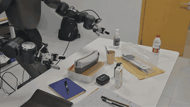</a>
<br><sub>Unzip the pencil case and place the blue pen</sub><br><a href="./docs/assets/videos/real/Spirit%20AI%20MOZ1/unzip-pencil-case/third-person.mp4">Watch full video</a>
</td>
<td align="center">
<a href="./docs/assets/videos/real/Spirit%20AI%20MOZ1/fold-paper-bag/third-person.mp4">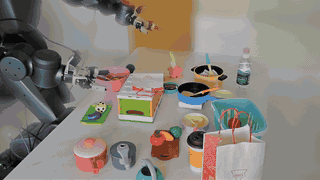</a>
<br><sub>Fold the paper bag</sub><br><a href="./docs/assets/videos/real/Spirit%20AI%20MOZ1/fold-paper-bag/third-person.mp4">Watch full video</a>
</td>
<td align="center">
<a href="./docs/assets/videos/real/Spirit%20AI%20MOZ1/write-hi-with-brush/third-person.mp4">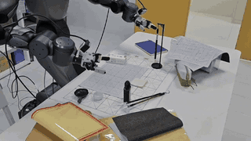</a>
<br><sub>Pick up the brush and write “Hi”</sub><br><a href="./docs/assets/videos/real/Spirit%20AI%20MOZ1/write-hi-with-brush/third-person.mp4">Watch full video</a>
</td>
</tr>
</table>

## 🛠️ Environment setup

```bash
conda create -n aed python=3.10 -y
conda activate aed
pip install -U pip
pip install torch==2.7.1+cu128 torchvision==0.22.1+cu128 \
  --extra-index-url https://download.pytorch.org/whl/cu128
pip install -e .
```

Set the Wan model cache before training or evaluation:

```bash
export DIFFSYNTH_MODEL_BASE_PATH="$(pwd)/checkpoints"
```

Install the official [LIBERO](https://github.com/Lifelong-Robot-Learning/LIBERO) or [RoboTwin](https://github.com/RoboTwin-Platform/RoboTwin) environment separately, including simulator assets.

## 📦 Model preparation

Generate the ActionDiT action backbone once:

```bash
python scripts/preprocess_action_dit_backbone.py \
  --model-config configs/model/aed_wam.yaml \
  --output checkpoints/ActionDiT_linear_interp_Wan22_alphascale_1024hdim.pt \
  --device cuda \
  --dtype bfloat16
```

Precompute task text embeddings before training:

```bash
# LIBERO AED configuration
python scripts/precompute_text_embeds.py \
  task=libero_aed_wam_vae_memory_2cam224_1e-4

# RoboTwin AED configuration
python scripts/precompute_text_embeds.py \
  task=robotwin_aed_wam_vae_memory_3cam384_1e-4
```

For multiple GPUs:

```bash
torchrun --standalone --nproc_per_node=8 scripts/precompute_text_embeds.py \
  task=libero_aed_wam_vae_memory_2cam224_1e-4
```

## 📂 Data preparation

### LIBERO

Download the preprocessed dataset from [Hugging Face](https://huggingface.co/datasets/yuanty/LIBERO-fastwam), then extract the archives:

```bash
mkdir -p data/libero_mujoco3.3.2
cd data/libero_mujoco3.3.2
for f in *.tar.gz; do tar -xzf "$f"; done
```

Expected directories:

```text
data/libero_mujoco3.3.2/
├── libero_10_no_noops_lerobot/
├── libero_goal_no_noops_lerobot/
├── libero_object_no_noops_lerobot/
└── libero_spatial_no_noops_lerobot/
```

Install the matching MuJoCo version:

```bash
pip install mujoco==3.3.2
```

### RoboTwin

Download the preprocessed dataset from [Hugging Face](https://huggingface.co/datasets/yuanty/robotwin2.0-fastwam), then concatenate and extract the split archives:

```bash
mkdir -p data/robotwin2.0
cd data/robotwin2.0
cat robotwin2.0.tar.gz.part-* | tar -xzf -
```

Expected layout:

```text
data/robotwin2.0/robotwin2.0/
├── data/
├── meta/
└── videos/
```

## 🚀 Training

Before the first run, set `pretrained_norm_stats: null` in the selected data configuration. After the first run, point it to the generated `dataset_stats.json` for resumed or reproducible training.

```bash
# LIBERO AED + motion-aware transition
bash scripts/train_zero1.sh 8 \
  task=libero_aed_wam_vae_memory_2cam224_1e-4

# RoboTwin AED + motion-aware transition
bash scripts/train_zero1.sh 8 \
  task=robotwin_aed_wam_vae_memory_3cam384_1e-4
```

The first argument is the number of processes. Adjust it to the GPUs available on one node. Use a tmux session for long runs and keep the run directory containing checkpoints, logs, resolved configuration, and dataset statistics.

## 🤗 Hugging Face checkpoints

The AED checkpoints use the [OKayQi/AED](https://huggingface.co/OKayQi/AED) model repository. Install the Hugging Face Hub client and log in before uploading or downloading files:

```bash
pip install -U huggingface_hub
hf auth login
```

Upload the two checkpoint directories from this release:

```bash
hf upload OKayQi/AED checkpoints/libero_last libero_last --repo-type model
hf upload OKayQi/AED checkpoints/robotwin_latest robotwin_latest --repo-type model
```

Download them into the matching local directories:

```bash
hf download OKayQi/AED \
  libero_last/step_last.pt libero_last/dataset_stats.json \
  --local-dir checkpoints
hf download OKayQi/AED \
  robotwin_latest/step_last.pt robotwin_latest/dataset_stats.json \
  --local-dir checkpoints
```

## 🧪 Testing released checkpoints

### LIBERO 42K

```bash
python experiments/libero/run_libero_manager.py \
  task=libero_aed_wam_vae_memory_2cam224_1e-4 \
  ckpt=./checkpoints/libero_last/step_last.pt \
  EVALUATION.dataset_stats_path=./checkpoints/libero_last/dataset_stats.json \
  MULTIRUN.num_gpus=8
```

Use `MULTIRUN.num_gpus=4` or another value when fewer GPUs are available.

### RoboTwin 50K

```bash
python experiments/robotwin/run_robotwin_manager.py \
  task=robotwin_aed_wam_vae_memory_3cam384_1e-4 \
  ckpt=./checkpoints/robotwin_latest/step_last.pt \
  EVALUATION.dataset_stats_path=./checkpoints/robotwin_latest/dataset_stats.json \
  MULTIRUN.num_gpus=8
```

Create the policy link required by the official RoboTwin environment:

```bash
ln -sfn "$(pwd)/experiments/robotwin/wam_policy" \
  "$(pwd)/third_party/RoboTwin/policy/wam_policy"
```

Set `EVALUATION.instruction_type=seen` to evaluate seen instructions; the default evaluation uses unseen instructions.

## 🎬 Demonstrations and supplementary videos

### Real-world demonstrations

#### Spirit AI MOZ1 OOD Settings

<table>
<tr>
<td align="center" valign="top" width="33%">
<a href="./docs/assets/videos/real/Spirit%20AI%20MOZ1/mushroom-orange-basket-ood/cluttered-background.mp4">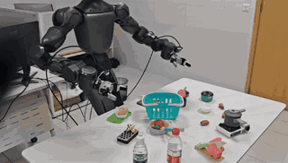</a>
<br><sub>Mushroom Orange Basket OOD — Cluttered Background</sub><br>
<a href="./docs/assets/videos/real/Spirit%20AI%20MOZ1/mushroom-orange-basket-ood/cluttered-background.mp4">Watch full video</a>
</td>
<td align="center" valign="top" width="33%">
<a href="./docs/assets/videos/real/Spirit%20AI%20MOZ1/mushroom-orange-basket-ood/low-light-conditions.mp4">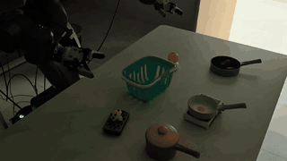</a>
<br><sub>Mushroom Orange Basket OOD — Low Light Conditions</sub><br>
<a href="./docs/assets/videos/real/Spirit%20AI%20MOZ1/mushroom-orange-basket-ood/low-light-conditions.mp4">Watch full video</a>
</td>
<td align="center" valign="top" width="33%">
<a href="./docs/assets/videos/real/Spirit%20AI%20MOZ1/mushroom-orange-basket-ood/object-color-changes.mp4">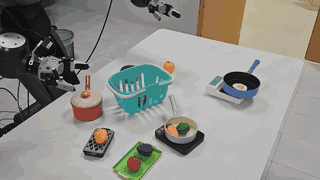</a>
<br><sub>Mushroom Orange Basket OOD — Object Color Changes</sub><br>
<a href="./docs/assets/videos/real/Spirit%20AI%20MOZ1/mushroom-orange-basket-ood/object-color-changes.mp4">Watch full video</a>
</td>
</tr>
</table>

#### Spirit AI MOZ1

<table>
<tr>
<td align="center" valign="top" width="33%">
<a href="./docs/assets/videos/real/Spirit%20AI%20MOZ1/cook-food-with-spatula/third-person.mp4">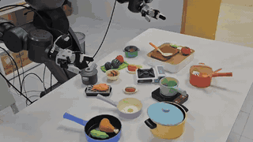</a>
<br><sub>Cook Food With Spatula</sub><br>
<a href="./docs/assets/videos/real/Spirit%20AI%20MOZ1/cook-food-with-spatula/third-person.mp4">Watch full video</a>
</td>
<td align="center" valign="top" width="33%">
<a href="./docs/assets/videos/real/Spirit%20AI%20MOZ1/fold-paper-bag/third-person.mp4"></a>
<br><sub>Fold Paper Bag</sub><br>
<a href="./docs/assets/videos/real/Spirit%20AI%20MOZ1/fold-paper-bag/third-person.mp4">Watch full video</a>
</td>
<td align="center" valign="top" width="33%">
<a href="./docs/assets/videos/real/Spirit%20AI%20MOZ1/lift-two-baskets/third-person.mp4">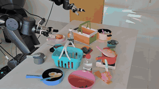</a>
<br><sub>Lift Two Baskets</sub><br>
<a href="./docs/assets/videos/real/Spirit%20AI%20MOZ1/lift-two-baskets/third-person.mp4">Watch full video</a>
</td>
</tr>
<tr>
<td align="center" valign="top" width="33%">
<a href="./docs/assets/videos/real/Spirit%20AI%20MOZ1/pepper-tomato-pot/third-person.mp4">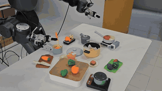</a>
<br><sub>Pepper Tomato Pot</sub><br>
<a href="./docs/assets/videos/real/Spirit%20AI%20MOZ1/pepper-tomato-pot/third-person.mp4">Watch full video</a>
</td>
<td align="center" valign="top" width="33%">
<a href="./docs/assets/videos/real/Spirit%20AI%20MOZ1/pick-two-white-bowls/third-person.mp4">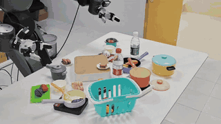</a>
<br><sub>Pick Two White Bowls</sub><br>
<a href="./docs/assets/videos/real/Spirit%20AI%20MOZ1/pick-two-white-bowls/third-person.mp4">Watch full video</a>
</td>
<td align="center" valign="top" width="33%">
<a href="./docs/assets/videos/real/Spirit%20AI%20MOZ1/place-knife-spatula/third-person.mp4">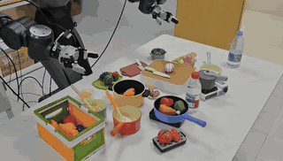</a>
<br><sub>Place Knife Spatula</sub><br>
<a href="./docs/assets/videos/real/Spirit%20AI%20MOZ1/place-knife-spatula/third-person.mp4">Watch full video</a>
</td>
</tr>
<tr>
<td align="center" valign="top" width="33%">
<a href="./docs/assets/videos/real/Spirit%20AI%20MOZ1/push-box-place-pot/third-person.mp4">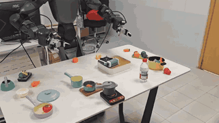</a>
<br><sub>Push Box Place Pot</sub><br>
<a href="./docs/assets/videos/real/Spirit%20AI%20MOZ1/push-box-place-pot/third-person.mp4">Watch full video</a>
</td>
<td align="center" valign="top" width="33%">
<a href="./docs/assets/videos/real/Spirit%20AI%20MOZ1/unzip-pencil-case/third-person.mp4"></a>
<br><sub>Unzip Pencil Case</sub><br>
<a href="./docs/assets/videos/real/Spirit%20AI%20MOZ1/unzip-pencil-case/third-person.mp4">Watch full video</a>
</td>
<td align="center" valign="top" width="33%">
<a href="./docs/assets/videos/real/Spirit%20AI%20MOZ1/write-hi-with-brush/third-person.mp4"></a>
<br><sub>Write Hi With Brush</sub><br>
<a href="./docs/assets/videos/real/Spirit%20AI%20MOZ1/write-hi-with-brush/third-person.mp4">Watch full video</a>
</td>
</tr>
</table>

#### Rokae AR5

<table>
<tr>
<td align="center" valign="top" width="33%">
<a href="./docs/assets/videos/real/rokae-ar5/blocks-on-shelves.mp4">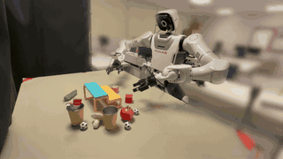</a>
<br><sub>Blocks On Shelves</sub><br>
<a href="./docs/assets/videos/real/rokae-ar5/blocks-on-shelves.mp4">Watch full video</a>
</td>
<td align="center" valign="top" width="33%">
<a href="./docs/assets/videos/real/rokae-ar5/chili-corn-boxes.mp4">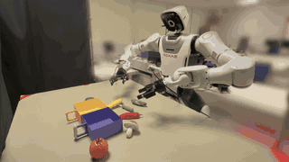</a>
<br><sub>Chili Corn Boxes</sub><br>
<a href="./docs/assets/videos/real/rokae-ar5/chili-corn-boxes.mp4">Watch full video</a>
</td>
<td align="center" valign="top" width="33%">
<a href="./docs/assets/videos/real/rokae-ar5/cup-toothbrush-yellow-shelf.mp4">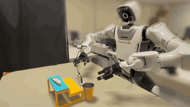</a>
<br><sub>Cup Toothbrush Yellow Shelf</sub><br>
<a href="./docs/assets/videos/real/rokae-ar5/cup-toothbrush-yellow-shelf.mp4">Watch full video</a>
</td>
</tr>
<tr>
<td align="center" valign="top" width="33%">
<a href="./docs/assets/videos/real/rokae-ar5/stack-cups-target-area.mp4">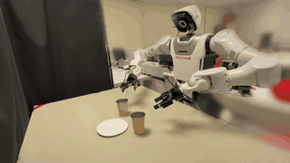</a>
<br><sub>Stack Cups Target Area</sub><br>
<a href="./docs/assets/videos/real/rokae-ar5/stack-cups-target-area.mp4">Watch full video</a>
</td>
<td align="center" valign="top" width="33%">
<a href="./docs/assets/videos/real/rokae-ar5/swap-red-green-peppers.mp4">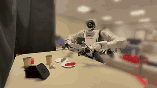</a>
<br><sub>Swap Red Green Peppers</sub><br>
<a href="./docs/assets/videos/real/rokae-ar5/swap-red-green-peppers.mp4">Watch full video</a>
</td>
<td width="33%"></td>
</tr>
</table>

### Simulation demonstrations

Three representative videos are shown for each simulation family.

#### LIBERO

<table>
<tr>
<td align="center" valign="top" width="33%">
<a href="./docs/assets/videos/libero/libero-10.mp4">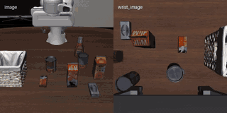</a>
<br><sub>Libero 10</sub><br>
<a href="./docs/assets/videos/libero/libero-10.mp4">Watch full video</a>
</td>
<td align="center" valign="top" width="33%">
<a href="./docs/assets/videos/libero/libero-goal.mp4">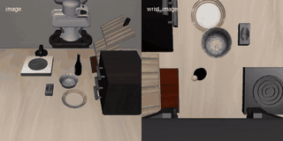</a>
<br><sub>Libero Goal</sub><br>
<a href="./docs/assets/videos/libero/libero-goal.mp4">Watch full video</a>
</td>
<td align="center" valign="top" width="33%">
<a href="./docs/assets/videos/libero/libero-object.mp4">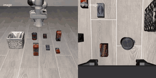</a>
<br><sub>Libero Object</sub><br>
<a href="./docs/assets/videos/libero/libero-object.mp4">Watch full video</a>
</td>
</tr>
</table>

#### LIBERO-Plus

<table>
<tr>
<td align="center" valign="top" width="33%">
<a href="./docs/assets/videos/libero-plus/language-instructions.mp4">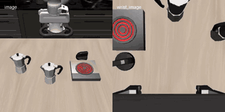</a>
<br><sub>Language Instructions</sub><br>
<a href="./docs/assets/videos/libero-plus/language-instructions.mp4">Watch full video</a>
</td>
<td align="center" valign="top" width="33%">
<a href="./docs/assets/videos/libero-plus/background-textures.mp4">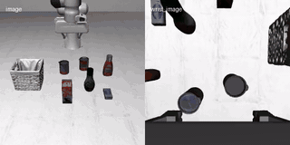</a>
<br><sub>Background Textures</sub><br>
<a href="./docs/assets/videos/libero-plus/background-textures.mp4">Watch full video</a>
</td>
<td align="center" valign="top" width="33%">
<a href="./docs/assets/videos/libero-plus/camera-viewpoints.mp4">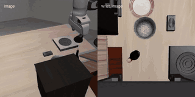</a>
<br><sub>Camera Viewpoints</sub><br>
<a href="./docs/assets/videos/libero-plus/camera-viewpoints.mp4">Watch full video</a>
</td>
</tr>
</table>

#### RoboTwin

<table>
<tr>
<td align="center" valign="top" width="33%">
<a href="./docs/assets/videos/robotwin/blocks-ranking-size.mp4">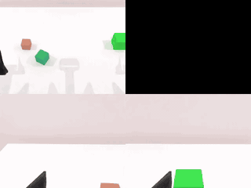</a>
<br><sub>Blocks Ranking Size</sub><br>
<a href="./docs/assets/videos/robotwin/blocks-ranking-size.mp4">Watch full video</a>
</td>
<td align="center" valign="top" width="33%">
<a href="./docs/assets/videos/robotwin/place-bread-basket.mp4">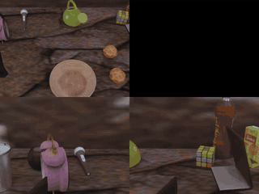</a>
<br><sub>Place Bread Basket</sub><br>
<a href="./docs/assets/videos/robotwin/place-bread-basket.mp4">Watch full video</a>
</td>
<td align="center" valign="top" width="33%">
<a href="./docs/assets/videos/robotwin/put-bottles-dustbin.mp4">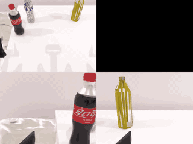</a>
<br><sub>Put Bottles Dustbin</sub><br>
<a href="./docs/assets/videos/robotwin/put-bottles-dustbin.mp4">Watch full video</a>
</td>
</tr>
</table>

## 📝 Cite

```bibtex
@misc{lyu2026learningskillshistoricalaction,
      title={Learning Skills from Historical Action Trajectories: Action Experience Dictionary for World Action Models},
      author={Qi Lyu and Jiahua Dong and Hao Shen and Xudong Wang and Hongyuan Yu and Baichen Liu and Henghui Ding and Zhi Han and Nicu Sebe and Ivan Laptev and Fahad Shahbaz Khan and Salman Khan},
      year={2026},
      eprint={2609.40219},
      archivePrefix={arXiv},
      primaryClass={cs.CV},
      url={https://arxiv.org/abs/2609.40219},
}
```
